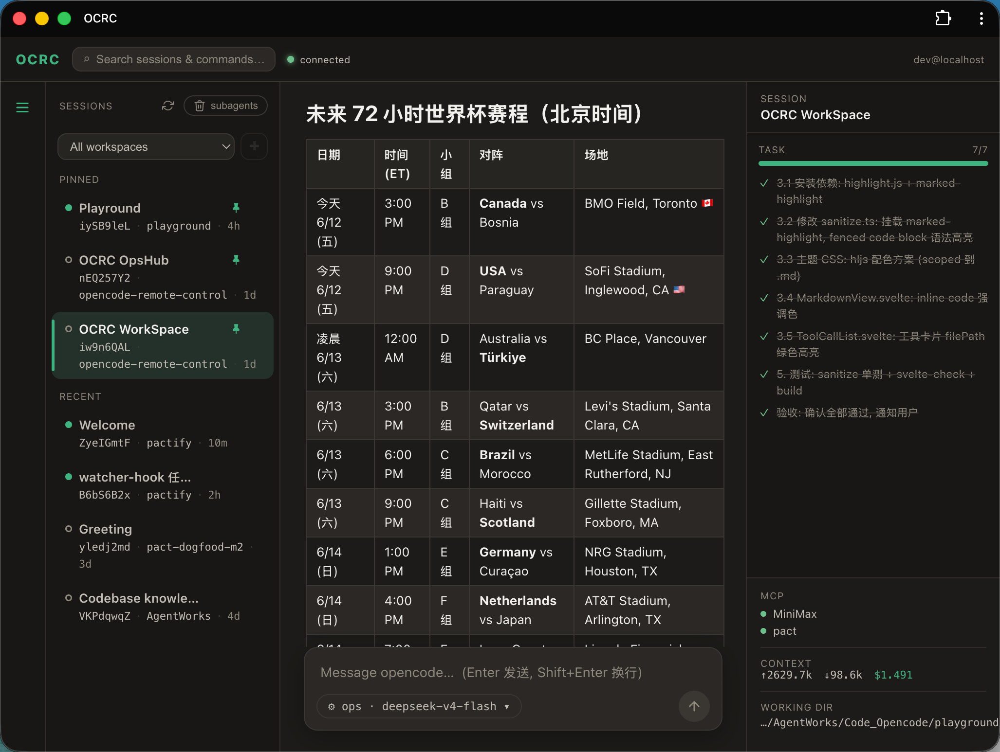

# OCRC — opencode-remote-control

> **Drive your local opencode from your phone or browser.** An [opencode](https://opencode.ai)
> **plugin** that runs a **Telegram bot + a Web PWA** in-process — fire off a prompt from
> anywhere and watch the assistant code in real time, even when you're away from your desk.

[](https://github.com/agentjoey/opencode-remote-control/releases)
[](LICENSE)
[](https://github.com/agentjoey/opencode-remote-control/actions)
[](https://opencode.ai)

<p align="center">
  
</p>

Install once; it auto-starts in-process with opencode. Same sessions stream live to
**Telegram** and a desktop **PWA** at the same time — switch surfaces mid-task without
losing context.

## ⚡ Quick start (5 minutes)

Requires **opencode 1.17+** and **Node 20+** (or Bun).

```bash
# 1. Clone, build (backend + PWA), and install the plugin
git clone https://github.com/agentjoey/opencode-remote-control
cd opencode-remote-control
npm install && npm run build:all
node dist/cli/install.js     # interactive — paste your Telegram bot token + user id

# 2. Run opencode from any directory — the plugin auto-starts
opencode
```

- **Telegram:** make a bot with [@BotFather](https://t.me/BotFather); get your numeric id from [@userinfobot](https://t.me/userinfobot) (the installer asks for both). Send "hello" → the assistant replies.
- **Web PWA:** the installer enables it by default. Run `oprc pair` (or send `/pair` in Telegram) → open the URL/QR it prints. Auth is a device **token** — no Cloudflare Access needed.
- **From another device:** the web binds to `localhost`, so expose it over a tunnel or VPN — e.g. `tailscale serve 17081`. See [Remote access without a domain](#remote-access-without-a-domain).

> Once published to npm, steps collapse to `npx opencode-remote-control install`.

## How we're different

- **Runs as an opencode plugin, in-process.** One install, no extra process, no
  daemon to babysit — it starts and stops with `opencode` itself.
- **Telegram + Web from a single codebase.** The same sessions stream live to
  Telegram and a desktop PWA simultaneously; switch surfaces mid-task without
  losing context.
- **SDK-native.** Built on `@opencode-ai/sdk` and the opencode plugin event
  hook — it speaks opencode's own protocol rather than scraping a UI, so agent /
  model overrides, approvals, diffs, and cost/token metadata all come through
  first-class.
- **Transport-agnostic core.** A channel-neutral `CardBus` carries structured
  cards; each transport renders them independently. Adding a new channel
  (Discord, Slack, …) doesn't touch the relay core.
- **Local-first & single-user.** It runs on your machine against your local
  opencode server, stores state in a local file, and answers to one allowlisted
  user. No cloud, no shared backend.

## Architecture

```
┌──────────────────────────────────────────────────────┐
│  opencode (single process)                            │
│                                                       │
│  ┌──────────────────┐  ┌───────────────────────────┐ │
│  │ AI engine :4096  │  │ plugin: remote-control     │ │
│  │                  │  │  ├─ Telegraf (Telegram)    │ │
│  │   event hook ────┼──┼─►├─ Hono + WS (Web PWA)    │ │
│  │                  │  │  └─ relay + CardBus        │ │
│  └──────────────────┘  └──────────┬────────────────┘ │
│                                   ▼                   │
│                          Telegram / Web (PWA)         │
└──────────────────────────────────────────────────────┘
```

The plugin loads inside opencode and is driven by the plugin **event hook**: it
submits prompts via the SDK, consumes streaming events, and renders structured
cards to whichever transports are enabled. A TUI, if you run one, is just
another client of the same opencode server.

Full deep-dive: [`docs/ARCHITECTURE.md`](docs/ARCHITECTURE.md).

## Quick Start (Telegram)

1. **Create a bot** with [@BotFather](https://t.me/BotFather), get a token.
2. **Find your user ID** — message [@userinfobot](https://t.me/userinfobot).
3. **Build and install the plugin** (opencode 1.17+):
   ```bash
   npm install && npm run build
   node dist/cli/install.js
   ```
   The installer writes a plugin bridge to `~/.config/opencode/plugins/`
   (opencode 1.17 loads local plugins from there — directory paths in
   `opencode.json` no longer work), ensures that dir's `package.json` has
   `"type": "module"`, and saves `TELEGRAM_BOT_TOKEN` / `ALLOWED_USER_IDS` /
   `WEB_ENABLED` / `WEB_PORT` to the repo's `.env`.
4. **Run opencode** from any directory — the plugin loads globally:
   ```bash
   opencode
   ```
   The plugin auto-starts. For an always-on remote-control hub, run it from a
   small/empty directory (e.g. `~/ocrc-hub`) so opencode's file watcher stays
   fast. You can run several opencode instances — they elect one **PRIMARY**
   (atomic lock at `~/.opencode/oprc-primary.lock`) to own the web (`:17081`) and
   Telegram singletons; the rest stand down PASSIVE. The web/bot can switch
   between the workspaces of the running instances.
5. **Send "hello"** in Telegram → the assistant responds.

## Web UI (PWA)

The Web UI runs alongside Telegram and shows the same sessions in real time
(full streaming), installable as a desktop/mobile PWA.

1. Set `WEB_ENABLED=true` (and `WEB_PORT` — default `17081`, since opencode's
   own server occupies `7081`).
2. Build the web app: `cd web && npm run build`.
3. The plugin serves the PWA at `http://127.0.0.1:17081`.

### Auth — pair a device (default, no Cloudflare Access needed)

Auth defaults to an app **token** (`WEB_AUTH=token`). Onboard a device with
`oprc pair` (or Telegram `/pair`): it prints a URL + QR with the token in the
fragment (`https://<host>/#token=…`). Open it once — the app stores the token
and attaches it to every request thereafter. The token is persisted at
`~/.opencode/oprc-token`, so it survives restarts and re-installs.

> Behind a tunnel, keep `WEB_CF_ACCESS_DEV_BYPASS=false`: `cloudflared` connects
> from loopback, so a loopback bypass would trust all tunnel traffic.

Prefer Cloudflare Access instead? Set `WEB_AUTH=cf-access` with
`WEB_CF_ACCESS_TEAM` / `WEB_CF_ACCESS_AUD` — see [`docs/OPS.md`](docs/OPS.md).

### Remote access without a domain

A PWA install needs a **secure context** (HTTPS, or `http://localhost`). To
reach the hub from another machine without owning a domain:

| Method | Command | Notes |
|---|---|---|
| **Tailscale** (recommended) | `tailscale serve 17081` | Stable `https://<host>.ts.net`, device-level auth, survives restarts |
| **cloudflared quick tunnel** | `cloudflared tunnel --url http://localhost:17081` | Free `https://*.trycloudflare.com`; URL changes each run |
| **SSH port-forward** | `ssh -L 17081:localhost:17081 <host>` | Then open `http://127.0.0.1:17081` (localhost = secure context) |

Set `WEB_PUBLIC_URL` to the resulting HTTPS URL so `/pair` emits the right
links. (If you already run a `cloudflared` tunnel to `:17081`, `/pair`
auto-detects its hostname from `~/.cloudflared`.) Plain `http://<LAN-IP>` is
**not** a secure context — Chrome won't install it as an app.

### Install as an app

In Chrome: the omnibox install icon, or **⋮ → Cast, save, and share → Install
page as app…**. The installed PWA reuses the browser's stored token, so it stays
signed in.

## Commands

| Command | Description |
|---|---|
| `/start` | Handshake + health check |
| `/status` | Server health, session count, pinned session |
| `/sessions` | List all sessions with pin buttons |
| `/session <id>` | Pin a specific session |
| `/workspaces` | List known workspaces (directories) |
| `/new` | Start a new session in the active workspace |
| `/rename <title>` | Rename the pinned session |
| `/files` | Files touched in the last session |
| `/diff` | Pending git diff for the session |
| `/todo` | Session todo list |
| `/context` | Tokens + cost + model for the session |
| `/agent` | Set next agent (sticky until cleared) |
| `/model` | Set next model (sticky until cleared) |
| `/current` | Show pinned session |
| `/abort` | Stop the current generation |
| `/pair` | Pair a device (URL + QR with token) for the Web PWA |
| `/version` | Plugin version + uptime |
| `/help` | Show this list |

Send any text to relay it into opencode.

## Push notifications

The plugin watches opencode sessions and proactively pushes summaries:

| Trigger | When | Content |
|---|---|---|
| Session finished | >60s run completes | Duration + assistant text summary (first 300 chars) |
| Test failure | Bash output contains FAIL/FAILED | Last 200 chars of output |

Rate limits: max 10 notifications/hour, 5-min cooldown per session. A session
the foreground UI just delivered is skipped (no double-ping).

## Multi-transport

Telegram and Web run simultaneously and share the same opencode session state,
relaying output to every connected channel in real time.

| Transport | Status | Notes |
|---|---|---|
| Telegram | ✅ Stable | Final-result delivery, pagination, approvals |
| Web (PWA) | ✅ Stable | SvelteKit, full streaming, token auth (default) / Cloudflare Access |

To add another channel, see
[`docs/transports/CONTRIBUTING-NEW-TRANSPORT.md`](docs/transports/CONTRIBUTING-NEW-TRANSPORT.md).

## Security model

- **Single-user per install.** Only the Telegram IDs in `ALLOWED_USER_IDS` can
  interact with the bot.
- **Local-first.** Runs on your machine, talks to your local opencode server,
  stores state in a local JSON file (`data/state.json`).
- **No secrets in repo.** `.env` is gitignored; `.env.example` documents every
  variable.
- **Web auth is pluggable.** Default is an app **token** (auto-generated,
  persisted `0600` at `~/.opencode/oprc-token`), verified on HTTP and WS with a
  constant-time compare; `WEB_AUTH=cf-access` switches to Cloudflare Access. The
  dev bypass only trusts a real loopback peer (never the bind address) and is
  **off by default**.

## Environment variables

| Variable | Default | Description |
|---|---|---|
| `TELEGRAM_BOT_TOKEN` | — (required) | Telegram bot token from @BotFather |
| `ALLOWED_USER_IDS` | — (required) | Comma-separated allowed Telegram user IDs |
| `OPENCODE_BASE_URL` | — | opencode server URL. Unused in plugin mode (the SDK client is injected); legacy/sidecar only |
| `CHAT_TIMEOUT_MS` | `600000` | Per-message timeout (ms) |
| `TUI_VISIBLE` | `true` | Navigate the TUI to the target session; `false` = pure direct API |
| `STATE_PATH` | `./data/state.json` | Persistent state file |
| `LOG_LEVEL` | `info` | `debug` \| `info` \| `warn` \| `error` |
| `TG_CHUNK_SOFT_LIMIT` | `3500` | Telegram message pagination soft limit |
| **Web** |||
| `WEB_ENABLED` | `false` | Enable the Web transport |
| `WEB_HOST` | `127.0.0.1` | Web bind address (keep loopback; front with a tunnel) |
| `WEB_PORT` | `17081` | Web port (opencode 1.17's own server occupies `7081`) |
| `WEB_AUTH` | `token` | Auth strategy: `token` (app token) or `cf-access` |
| `WEB_TOKEN` | auto | App token; auto-generated and persisted `0600` at `~/.opencode/oprc-token` if unset |
| `WEB_PUBLIC_URL` | — | Public URL for pairing/QR; falls back to LAN, then loopback |
| `WEB_STATIC_ROOT` | `<repo>/web/dist` | Built PWA path (resolved from the plugin dir, cwd-independent) |
| `WEB_SESSION_CACHE_SIZE` | `100` | Per-session card ring-buffer size |
| `WEB_CF_ACCESS_TEAM` | — | Cloudflare Access team name (when `WEB_AUTH=cf-access`) |
| `WEB_CF_ACCESS_AUD` | — | Cloudflare Access app AUD tag (when `WEB_AUTH=cf-access`) |
| `WEB_CF_ACCESS_DEV_BYPASS` | `false` | Bypass auth **only for a loopback socket peer** |

## opencode 1.17+ notes

opencode 1.17 changed plugin loading; this project accounts for all of it:

- **Local plugins load from `~/.config/opencode/plugins/`**, not from directory
  paths in `opencode.json`. The installer writes a bridge file there that
  re-invokes the built `dist/` (the source of truth — rebuild + restart to
  update). 1.17 also only calls functions *defined* in the loaded module, so the
  bridge wraps the plugin in a local function rather than re-exporting it.
- **Plugins run in a worker thread.** An unhandled rejection would otherwise
  crash the worker (`Worker has been terminated`), taking down the web server.
  The plugin installs absorbing guards so it survives.
- **Web runs on `17081`** because opencode's own server occupies `7081`. Point
  your tunnel ingress at `17081`.
- **PRIMARY election.** Web (`:17081`) and the Telegram bot are global
  singletons. Multiple opencode instances elect one PRIMARY (atomic lock at
  `~/.opencode/oprc-primary.lock`) to own them; the others stand down PASSIVE.
  Run the hub from a small/empty directory so the file watcher stays fast.

## Testing

```bash
npm test                            # backend unit tests
npx tsc --noEmit                    # backend type-check
cd web && npm run check             # web type-check (svelte-check)
cd web && npm test                  # web unit tests
cd web && npm run build             # build PWA
```

## License

MIT — see [LICENSE](LICENSE).
